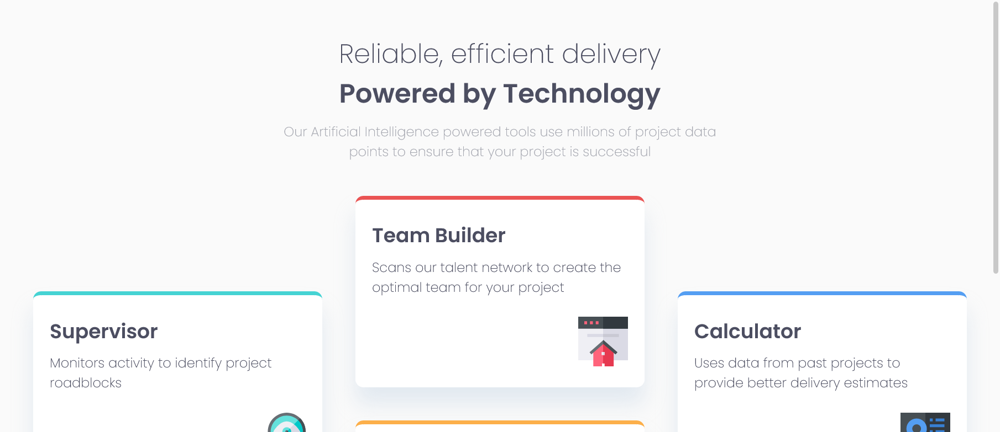
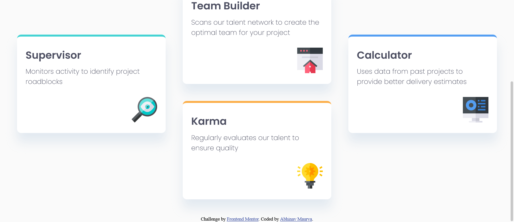
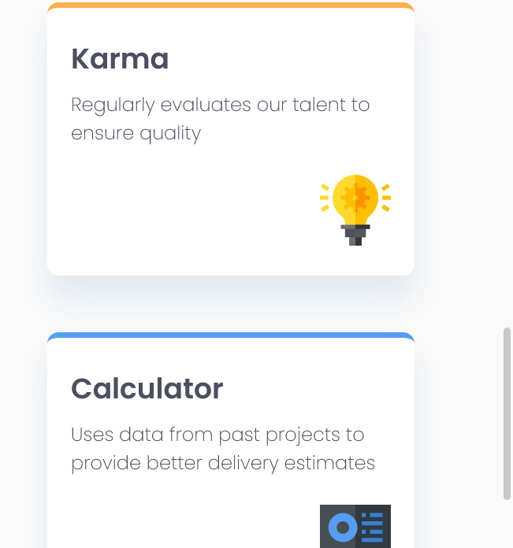

# Frontend Mentor - Four card feature section solution

This is a solution to the [Four card feature section challenge on Frontend Mentor](https://www.frontendmentor.io/challenges/four-card-feature-section-weK1eFYK). Frontend Mentor challenges help you improve your coding skills by building realistic projects. 

## Table of contents

- [Overview](#overview)
  - [Screenshot](#screenshot)
  - [Links](#links)
- [My process](#my-process)
  - [Built with](#built-with)
- [Author](#author)

## Overview
This is great project for practicing grid layout and also it will teach you that how to play with border width and color.

### Screenshot

### Links

- Solution URL: [Github](https://github.com/abno-24/Four-Card-Feature)
- Live Site URL: [Github Pages](https://abno-24.github.io/Four-Card-Feature/)

## My process

### Built with

- Semantic HTML5 markup
- CSS custom properties
- Flexbox
- CSS Grid

## Author

- Website - [Portfolio](https://abno-24.github.io/Portfolio/)
- Frontend Mentor - [@abno-24](https://www.frontendmentor.io/profile/abno-24)
- Twitter - [@abno_24](https://twitter.com/abno_24)